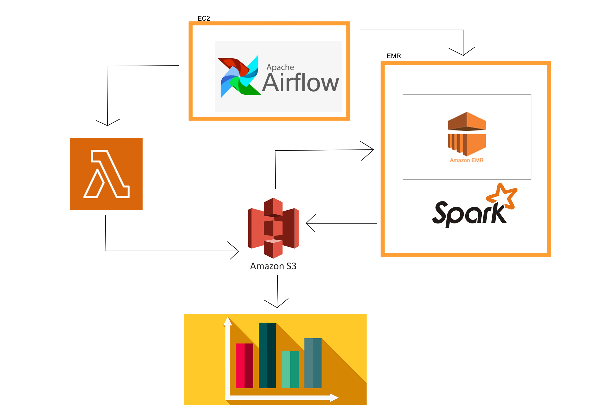

# WCD_DE_Project

Mid Term  data pipeline for WCD DE course.  The overall goal is to build an end-to-end pipeline to process data.

### Overview

This data pipeline has the job of:
1. Scrap reddit comment data from a subreddit
2. Store data in an S3 bucket
3. Utilize spark + EMR to transform the data
4. Use AWS Glue + Athena to use the data
4. Create a simple visualization of the transformed data

Our goal with this pipeline is to scrap data and transform it into a count of words used in Reddit comments so that we can see what the most used words are.  We do this by first scrapping data via a lambda function, clean and transform the data in EMR and then create a visualization from the transformed data.

### Airflow

Airflow runs on an EC2 instance and manages the whole pipeline.

### Lambda Function

The lambda function here contains a python script that uses the Reddit API to scrap comments from a subreddit, r/worldnews in this case.  The lambda function is invoked by Airflow to run on an hourly basis.

### S3 Bucket

The S3 Bucket, jonathan-wcd-midterm, holds our data, spark job and bootstrap script.  It is divided into 3 "folders":

1. Landing
2. Scripts
3. Target

The Landing folder is where the Lambda function deposits the scrapped data.  Scripts contains our spark job file and bootstrap script and Target is where the transformed data from our spark job is deposited.

### EMR/Spark

We use an EMR cluster to run our Spark job to transform the data ingested from the Landing folder of our S3 bucket.  Note that the EMR cluster needs to be pointed to the bootstrap script in the S3 bucket in order to install extra libraries that do not automatically come with EMR.

### Final Parts

Once the pipeline has transformed our data, we can make use of it for visualizations or analysis as needed.
